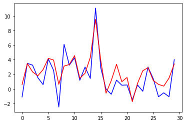

# SP500-project

Доброго дня исследователям финансовых рынков!

Предлагаю Вашему вниманию подход к анализу индекса S&P 500 и выработке рекомендательной системы для входа в сделку на инструменте, ассоциированом с этим индексом (допустим, ETF).

Если Вам знакомы термины и инструменты (или даже их практическое применение) как тейкпрофит, стоплосс, волатильность, временное окно, scikit-learn, pandas, tensorflow - смело читайте дальше. Вы обнаружите новые способы анализа финансовых рынков, и, возможно, разовьете идеи дальше.

Весь изложенный в данном материале код и гипотезы, размышления по поводу финансовых рынков - написаны лично. В том числе функции для формирования датасета. Серьезные программисты сочтут код неоптимальным, полагается скидка студенту курсов программирования Python, не имеющему фундаментального образования в сфере ИТ-технологий и без опыта промышленной разработки. Идеи тройного барьерного метода, ситуативного отбора почерпнуты из книг Маркос Лопез де Прадо, методы машинного обучения вдохновлены Ф.Шолле и С.Рашкой. По сути, нас в какой-то мере можно назвать продолжением книг, которые мы читали.

В этом материале будет показан нестандартный подход к временному ряду цены. За рекомендацию по сделке берется не сам ряд предыдущих цен акции, а комплекс факторов, на него влияющих. Анализируется весь рынок одновременно.
Подробности - прошу читать, запускать изложенный код и участвовать в анализе!

**Рекомендованная версия**: Python 3.7

**Набор пакетов Python для установки в виртуальное окружение:** в файле requirements.txt

**Рекомендованный порядок освоения материала исследования:**

 - 1-st_notebook.ipynb
 - 2-nd_notebook.ipynb
 - 3-rd_notebook.ipynb
 
 **Краткий обзор исследования**
 
 Вместо общепринятого технического анализа (вычисление индикаторов для принятия решений на основе графика одной акции), в исследовании рассмотрен следующий авторский подход. Для каждой акции из списка SP&500 поминутно вычисляется на основе определенного инвестором критерия количество признаков, свидетельствующих о желательности совершения сделки по данной акции. Показатели по всем акциям суммируются, в итоге в течение часа получаем два коэффициента (суммарное количество признаков для позиций Лонг и Шорт), которые являются характеристиками для входа в сделку по ETF SP&500. Третьим коэффициентом является относительный уровень индекса SP&500 на текущий час. Таким образом, на данный час у нас по индексу SP&500 есть три характеризующих его числа. Взяв таким образом данные за 32 предыдущих часа (включая текущий), получаем 3*32=96 признаков для формирования датасета для машинного обучения.
 
Зависимой переменной (таргет-столбцом) выступает сам индекс SP&500 (со сдвигом на 1 час), либо рассмотрен также подход формирования таргета как задача классификации со следующими метками: покупать, продавать, держать. Подробно рассмотрена роль волатильности текущего момента для динамически изменяемых уровней взятия прибыли (тейкпрофит) либо фиксации убытков (стоплосс).

Таким образом, применен кумулятивный всеобъемлющий подход к анализу рынка вместо изучения отдельных его компонентов-акций. Выдвинута гипотеза, что такой подход позволит методам машинного обучения (в частности, нейронным сетям) легче найти устойчивые закономерности в поведении индекса SP&500.

Задача выполнена успешно, свидетельством чему является валидационное (тестовое) подтверждение обученных моделей. В частности, обратим внимание на следующую иллюстрацию одного из результатов исследования:

Синим цветом – фактическое движение индекса SP&500, красным – рекомендации обученной нейронной сети на тестовых данных.

В исследовании подробно разбирается методология формирования датасета, и перечень шагов с обосновывающей логикой для достижения подобного результата.
Код на Python полностью воспроизводим на мощных многопроцессорных компьютерах.

